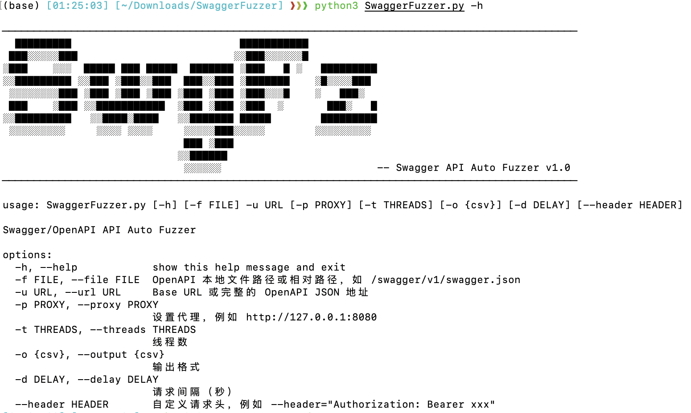

# 🔍 SwaggerFuzzer

🚨 **Swagger/OpenAPI 自动化接口 Fuzzer 工具**  
扫描、测试未授权访问、接口异常、数据泄漏问题 —— 面向 API 安全测试的轻量化命令行工具。

 

---

## ✨ 功能特性

- 🔍 自动解析 OpenAPI 3.0/3.1 JSON 文档（支持远程和本地文件）
- 🧪 构造所有 API 请求，包括 Path、Query、Header、Body 各种参数
- ⚡ 支持多线程并发测试接口，提升 fuzz 速度
- 📄 自动根据 content-type 构造 JSON、表单、XML、文件上传、ZIP、PDF 等请求体
- 🕵️ 检测敏感响应（如状态码 200、5XX、422、400）
- 🖨️ 控制台彩色输出简洁摘要（带状态码高亮）
- 📦 CSV 文件保存接口调用结果，支持后续分析
- 🔌 支持代理抓包（例如通过 BurpSuite 拦截）
- 🔐 可添加自定义请求头（如 Authorization）

---

## 🧑‍💻 安装与使用

### 🔧 环境依赖

- Python >= 3.8
- pip install requirements.txt:

```bash
pip install -r requirements.txt
```

### 🚀 快速使用

```bash
python main.py -u http://example.com -f swagger.json
```

或者只使用远程地址：

```bash
python main.py -u http://example.com/swagger/v1/swagger.json
```

 

### 🧰 支持参数

| 参数              | 说明                                    | 示例                                   |
| ----------------- | --------------------------------------- | -------------------------------------- |
| `-u`, `--url`     | 必填，base URL 或完整 OpenAPI JSON 地址 | `http://target.com`                    |
| `-f`, `--file`    | 可选，OpenAPI JSON 本地路径或相对路径   | `./swagger.json`                       |
| `-p`, `--proxy`   | 设置代理                                | `http://127.0.0.1:8080`                |
| `-t`, `--threads` | 多线程数量（默认1）                     | `-t 5`                                 |
| `-o`, `--output`  | 输出文件格式（当前仅支持 csv）          | `-o csv`                               |
| `-d`, `--delay`   | 每个请求间隔秒数                        | `-d 0.5`                               |
| `--header`        | 自定义请求头（可重复）                  | `--header="Authorization: Bearer xxx"` |

------

## 🔍 示例


------

## 📌 项目结构

```
.
├── SwaggerFuzzer.py     # 主程序逻辑（加载 spec、构造请求、发送与记录）
├── util.py              # 工具函数（header 解析、URL 拼接、加载 Swagger 文档）
├── requirements.txt     # 依赖库
├── README.md            # 使用说明
```

------

## ✅ TODO 列表

-  🚧 兼容 Swagger/OpenAPI 2.0（进行中）
-  🚧 增加参数模糊值生成（如长字符串、非法字符、uuid）

------

## 🙏 最后

本工具受启发于常见安全测试流程中对 Swagger 自动化利用的需求，适合搭配 BurpSuite 或自定义渗透工具链使用。

