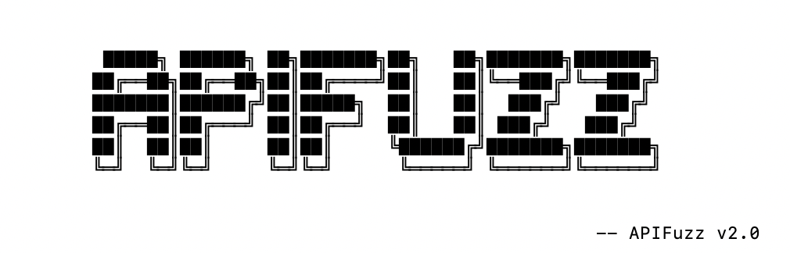

# 🚀 APIFuzz

通用API测试工具  
支持 Swagger 2.0、OpenAPI 3.x、WSDL/SOAP 多种协议的自动化模糊测试。

> 版本: v2.0 | 日期: 2025-07-26 | 兼容性: Python 3.6+

[](https://opensource.org/licenses/MIT)
[](https://www.python.org/downloads/)
[](https://github.com/your-username/APIFuzz/graphs/commit-activity)

 

------

## ✨ 功能特性

- Swagger 2.0、OpenAPI 3.x、WSDL/SOAP、ASP.NET .asmx 多协议支持
- 自动参数构造，支持多种数据格式（JSON、XML、表单、文件上传）
- 智能生成SOAP消息，自动解析ASMX服务页面和操作详情
- 多线程并发，边界值测试，动态命名空间
- 智能响应检测，彩色输出，结果导出，代理和认证支持
- 输出格式优化，进度条长度适中，信息提示友好

------

## ⚙️ 安装与使用

- Python >= 3.6
- 安装依赖包:

```bash
pip install -r requirements.txt
```

## 🚀 快速使用

> 常用参数说明：
> -u 目标URL（必填）
> -f 本地API文档（可选，支持json/xml）
> -p 代理（可选）
> -t 线程数（可选）
> --type WSDL自定义类型定义文件（可选）
> -o 输出格式（可选，默认csv）
> -d 请求间隔（可选）
> --header 自定义请求头（可重复）

### REST API（Swagger 2.0 / OpenAPI 3.x）
```bash
# 仅指定URL，自动检测API类型
python APIFuzz.py -u http://example.com

# 指定本地swagger文档
python APIFuzz.py -u http://example.com -f swagger.json

# 指定代理和多线程
python APIFuzz.py -u http://example.com -f swagger.json -p http://127.0.0.1:8080 -t 5

# 自定义请求头
python APIFuzz.py -u http://example.com -f swagger.json --header "Authorization: Bearer xxx"
```

### SOAP Web服务（WSDL）
```bash
# 基础WSDL测试
python APIFuzz.py -u http://example.com/soap -f soap.xml

# 使用自定义类型定义
python APIFuzz.py -u http://example.com/soap -f soap.xml --type bin.xml

# 远程WSDL直接URL
python APIFuzz.py -u http://example.com/wsdl/service

# 指定代理、输出格式、线程数
python APIFuzz.py -u http://example.com/soap -f soap.xml -p http://127.0.0.1:8080 -o csv -t 3
```

### ASP.NET .asmx Web服务
```bash
# 自动识别ASMX服务并测试
python APIFuzz.py -u http://example.com/WebService1.asmx

# 指定代理和请求间隔
python APIFuzz.py -u http://example.com/WebService1.asmx -p http://127.0.0.1:8080 -d 0.5
```

### 组合高级用法
```bash
# 多参数组合，适用于所有协议
python APIFuzz.py -u http://target.com -f api.json -p http://127.0.0.1:8080 -t 4 -o csv -d 1 --header "X-Token: test" --header "User-Agent: APIFuzz"
```

------

## 🧰 支持参数

| 参数              | 说明                                  | 示例                                   |
| ----------------- | ------------------------------------- | -------------------------------------- |
| -u, --url         | 必填，base URL 或完整 API 文档地址    | http://target.com                      |
| -f, --file        | 可选，API文档本地路径（JSON/XML格式） | ./swagger.json 或 ./soap.xml           |
| --type            | 可选，WSDL自定义类型定义文件          | --type bin.xml                         |
| -p, --proxy       | 设置代理                              | http://127.0.0.1:8080                  |
| -t, --threads     | 多线程数量（默认1）                   | -t 5                                   |
| -o, --output      | 输出文件格式（当前仅支持 csv）        | -o csv                                 |
| -d, --delay       | 每个请求间隔秒数                      | -d 0.5                                 |
| --header          | 自定义请求头（可重复）                | --header="Authorization: Bearer xxx"   |

------

## 🖼️ 示例


------

## 🗂️ 项目结构

```
.
├── core/                    # 核心功能模块
│   ├── __init__.py         # 工厂函数和版本检测
│   ├── base.py             # 抽象基类定义
│   ├── swagger2.py         # Swagger 2.0 处理模块
│   ├── openapi3.py         # OpenAPI 3.x 处理模块
│   ├── wsdl.py             # WSDL/SOAP 处理模块
│   ├── wsdl_types.py       # WSDL自定义类型定义解析器
│   └── asmx.py             # ASP.NET .asmx Web服务处理模块
├── APIFuzz.py              # 主程序入口
├── util.py                 # 工具函数
├── requirements.txt        # 依赖库
└── README.md               # 使用说明
```

------

## 📝 更新日志

### v2.0 (2025-07-26)
- 新增ASMX模块，支持ASP.NET .asmx Web服务自动解析和测试，兼容标准与非标准页面结构
- 支持双namespace策略，自动检测页面namespace和fallback namespace，最大化兼容性
- SOAPAction和服务名提取逻辑优化，确保SOAP消息和请求头构造正确
- 输出格式全面优化，方法名、URL、状态码、操作名对齐，错误信息简化
- 进度条长度优化，保持与banner宽度一致，进度显示友好
- 统一所有模块的输出风格和结果摘要，提升用户体验
- 代码结构优化，移除冗余解析和重复输出，提升健壮性和可维护性

------

## ✅ 已完成功能

- 多协议支持：Swagger 2.0、OpenAPI 3.x、WSDL/SOAP、ASP.NET .asmx
- 通用WSDL解析，支持任意格式的WSDL服务
- 安全测试策略，边界值测试，无攻击性载荷
- 自定义类型增强，支持外部类型定义文件
- 多线程并发，高效的并发测试能力
- 智能参数生成，基于参数名称的智能测试值生成
- 动态命名空间，自动适配各种WSDL服务格式
- 二进制数据处理，智能处理文件上传和二进制数据格式
- JSON序列化健壮性，完善的错误处理和数据转换
- 信息提示优化，详细的解析和测试进度反馈
- 输出格式优化，完美对齐的输出格式，简洁的错误信息显示
- 进度条优化，适中长度的进度条，与界面宽度保持一致
- ASMX双namespace策略，智能处理页面namespace和fallback namespace，最大化兼容性

------

## 📅 未来计划

- 更多输出格式：JSON、HTML报告格式支持
- 响应特征匹配：智能识别接口异常和漏洞

------

## 💡 项目灵感

这个工具源于日常安全测试中对 Swagger、SOAP 自动化利用的实际需求，很适合搭配 BurpSuite 或你的自定义渗透工具链使用。


如果它帮到你了，点个 ⭐ Star 支持下吧！

------

## 📄 开源协议

本项目采用 [MIT License](LICENSE) 开源协议。

------


